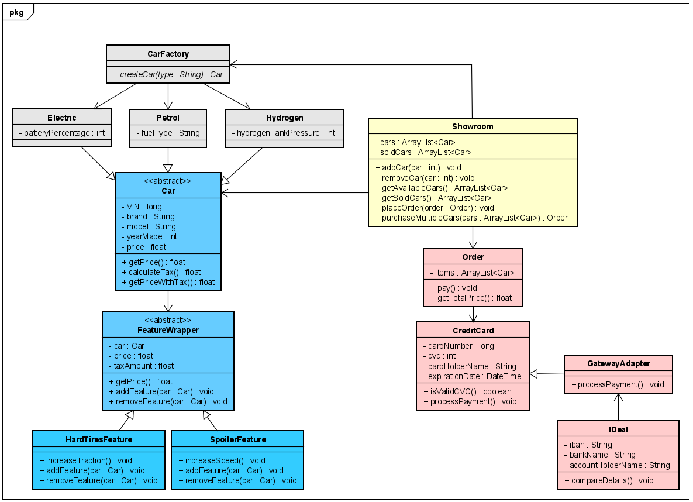

# Repository for Design Patterns Course Year 3 Period 3

_______________________________________________________

## Problem Description

In the buzzing world of automotive retail, efficiency and customer satisfaction are paramount. Our esteemed car
showroom, renowned for its diverse selection and impeccable service, seeks to elevate its operations with a
sophisticated management system. This system aims to revolutionize the way we interact with customers, manage inventory,
process payments, and streamline various aspects of our showroom's day-to-day activities.

// Needs to be rephrased

--- 
In 2024 the automotive world has a wide variety of vehicles whether they are diesel, petrol or if your environmentally conscious electric.
Our car showroom has everything you want on offer. Whether it's a daily driver or your dream mobile. Our showroom allows you endless customisation
where you let your wishes be our command. We offer a way of getting the car you want and how you want it directly to you. The best part?, your in control
the whole time!

_______________________________________________________

## Design Patterns Involved

| Serial Number | Pattern Type   | Pattern Description                                                                                                              | 
|:-------------:|----------------|----------------------------------------------------------------------------------------------------------------------------------|
|      1.       | Factory Method | Ability to obtain instances of class objects without needing to know the specific implementation details or subclass types       |
|      2.       | Decorator      | Allows things to be added to individual objects dynamically, without affecting the behavior of other objects from the same class | 
|      3.       | Adapter        | Acts as a bridge between two or more incompatible interfaces, allowing them to collaborate without modifying their source code   |
|      4.       | Observer       | Maintains a list of its dependents, and notifies them of any changes in state, usually by calling one of their methods           |

## Design Pattern Implementation

### 1. Factory Method Pattern:

The app offers different types of cars, each with its own engine types. Implementation of the Factory Method pattern for
generating car type objects is based on the customer's selective preference.

In Pseudo-Code: Create an abstract class/interface `CarType` representing the type of engine the car runs on. Then,
create subclasses
like `PetrolCarType`, `DieselCarType`, etc., each implementing the `CarType` abstract class/interface and providing
their own implementations for generating car types. The `CarTypeFactory` Class acts as a factory method, responsible for
creating instances of car type classes based on the customer's selection.

### 2. Decorator Pattern:

Customers may have different preferences for their car, such as adding an air freshener, a rear camera, or an
under-glow. To accommodate these preferences, the Decorator pattern can be implemented to dynamically modify the
features of the car based on customer selections.

In Pseudo-Code: Create a `CarFeature` interface representing a feature of the car. Then, create feature implementations
like `AirFreshener`, `RearCamera`, etc. each adding specific modifications to the base car features. When a customer
selects a
feature, decorators can be dynamically applied based on their preferences.

### 3. Adapter Pattern:

The Showroom uses multiple gateways to complete transactions(IDeal, Paypal, ApplePay). However, each
payment gateway may have a different interface for processing payments. We can implement the Adapter pattern to create
adapters for different payment gateways so that the customers can use whatever gateway they prefer.

In Pseudo-Code: Create an `PaymentGateway` interface representing the common operations required for processing
payments. Then, implement adapter classes like `PayPalAdapter`, `IDealAdapter`, etc., each adapting the interface of a
specific payment gateway to the `PaymentGateway` interface.

### 4. Observer Pattern:

The Showroom also takes care of a stock management system for their cars and needs to notify interested parties, such as
suppliers, whenever there are changes in the stock levels of certain car models. We can implement the Observer pattern
to achieve this.

In Pseudo-Code: Create a `CarStockSubject` interface that maintains the stock levels of car models. Then, create classes
like `CarModelStockManager` that implement this interface and manages the stock levels of different car models. The
`CarStockSubject` also maintains a list of observers such as suppliers and notifies them whenever there are changes in
the stock levels.

_______________________________________________________

## MoSCoW Analysis

| Serial Number | Requirement                                                       | Must have | Should have | Could have | Won't have |
|:-------------:|-------------------------------------------------------------------|:---------:|:-----------:|:----------:|:----------:|
|       1       | Adding a 4th pattern in case we need to fall back on it           |          |             |       ✅     |            |  
|       2       | Ability to add and remove new cars to and from the showroom       |     ✅     |             |            |            |
|       3       | Ability to customise your car prior to placing an order           |           |      ✅      |            |            |
|       4       | Deals and promotions for cars and addons at the payment interface |           |      ✅      |            |            |
|       5       | Ability to see what inventory was sold                            |           |             |     ✅      |            |
|       6       | Ability to see the summary of the ordered items                   |           |             |     ✅      |            |
|       7       | Ability to register and create users                              |           |             |            |     ✅      |
|       8       | Ability to purchase multiple cars in a single order               |           |             |            |     ✅      |

_______________________________________________________

## Class Diagram

